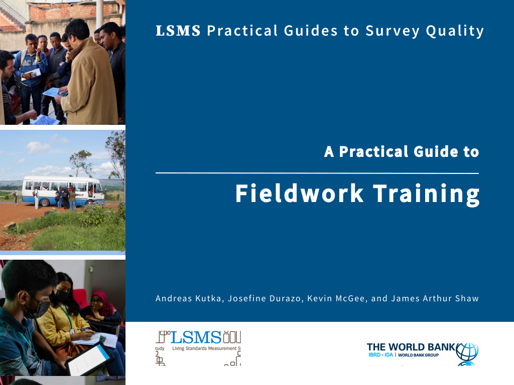

Welcome to **A Practical Guide to Fieldwork Training**, part of the LSMS series of **Practical Guides to Survey Quality**.

- To read the guide, visit (https://lsms-worldbank.github.io/pg2sq-training/). 
- Edit the book by updating the .Rmd files of the corresponding chapter. You can also reach them by clicking the edit button on top when reading the book. If accepted, your suggestions will be added with the next version.
- For any comments on possible improvements, list an issue.
