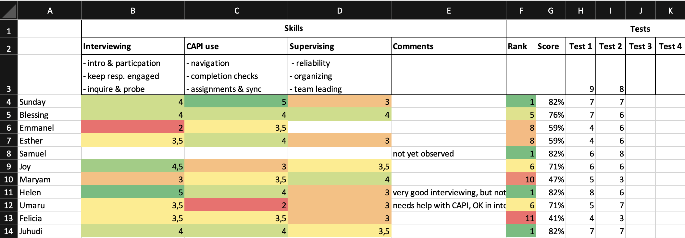

# Assess & select fieldworkers {#assess-select}

Using a competitive capacity-based process to select fieldworkers is critical for survey quality. Continuously assess trainee performance and select interviewers, supervisors and other positions at the end of the training, based on their demonstrated capacity. Selection should be informed by trainees’ understanding of the survey content as evaluated in written tests, by other relevant skills and characteristics observed throughout training, and (in some cases) by standardization tests. [Excess fieldworkers](#trainingsize) need to be trained to implement a competitive selection process. This chapter provides a step-by-step guide on how to evaluate trainees and select fieldworkers. 

Assessment-based selection of fieldworkers serves several important functions: 

1. __Improves overall fieldworker capacity__. Most importantly, selecting fieldworkers based on their ability to perform well ensures a high capability level among fieldworkers. Other selection criteria, such as experience or seniority (time with the organization) are often insufficient or even counterproductive – experienced fieldworkers might need to “unlearn” undesired habits from other surveys or might feel overconfident and pay less attention during training, resulting in them sometimes being less qualified than newer recruits. Continuous assessment during training provides a solid picture of trainee’s capacity to work on this specific survey.

1. __Increases attention during training__. Knowing about the competitive merit-based selection and having early and frequent tests, reinforces to trainees that it matters to pay attention, participate, and independently study material. This is often true for experienced fieldworkers who otherwise may not pay full attention, being confident that they will be hired anyway. Regular tests make it clear to trainees what they do not know. Knowing their relative score during the training also motivates low performers to increase their efforts. Higher attention and participation lead to  higher learning outcomes and better performance.

1. __Tailored feedback and training__. Early test results reveal content areas that are poorly understood and need more attention in training. Reviewing and debriefing written tests also provides valuable insights on where misunderstandings stem from or why mistakes are made. Trainers can tailor subsequent sessions and feedback to address these issues, improving the overall understanding level of trainees.  

1. __Verification of methodology__. The process of drafting and debriefing tests often reveals gaps in the questionnaire design, such as underdefined concepts or conflicting definitions, and helps verify whether explanations in the manual are useful. It is a great way to check if interviewers’ understanding is aligned with questionnaire design.

1. __Fieldworkers do better__. As humans, we simply do better at work if we know that it matters. Testing and competitive selection help convey to fieldworkers that it is really important for them to do their job well.  

1. __Builds a reserve of replacement fieldworkers__. Trainees who did not get selected (but performed adequately) can be designated as replacements, in the event of any  fieldworkers dropping out during fieldwork. Since they have undergone the full training, they can be brought up to speed relatively quickly with a refresher training, some practicing and strong supervision during their first few field days. 

For many surveys, fieldworkers are selected by the organization or firm implementing the survey, which might have their own requirements/procedures to follow. Be aware that these selection criteria and processes might lead to sub-optimal selection outcomes. Where possible, require desired protocols for the selection process, e.g., by explicitly detailing in the ToR the necessity to train an excess of trainees, select fieldworkers based on capability, have a transparent and objective process for doing so, etc. Make clear your own role in the audit/approval process by requiring that the firm submit their scoring process and selection results. 

## Written tests

Regular written tests play an important part in the evaluation of trainee performance. They are a very useful means to systemically test trainees' understanding of questionnaire content and training material and to identify general areas of weakness that need to be reinforced during the ongoing training.   

__Conduct written tests on a regular basis__ throughout the training. This could be daily or every other day, whenever new theoretical content has been covered or after debriefs are held. For written tests to be fully effective, it is crucial that they are conducted from the very beginning of training. Leaving written tests to the end of training usually means it will be too late to alert low performers to increase their efforts or to adjust the training schedule to retrain content that is generally poorly understood.  

### Designing tests 

Written tests should probe the understanding of questionnaire and manual contents covered in the training so far (protocols, definitions, answer options), as well as the relevant general skills (calculating a percentage, converting quantities from one unit to another, etc.). If possible, tailor tests to specific discussions from the (previous) day, so that tests also probe if trainees paid attention. Repeat questions or topics from previous tests that a large share of trainees answered incorrectly.  

Write questions that are very clear, can be answered unambiguously and can be easily scored. Do not rely too heavily on simple multiple-choice questions – they tend to be relatively easy to guess an answer and may not reflect actual levels of understanding. Likewise, true/false questions can be answered correctly 50% of the time just by randomly selecting an answer. Instead, focus on questions that force the trainee to actively come up with an answer or require a combination of answers to be selected to be correct. Open-ended questions take longer to review; only include them if there are enough resources to systematically score them for all trainees. 

Don’t make the questions too obvious. Sprinkle irrelevant or misleading information into the questions and answer options. Add answer options such as`Don’t have enough information`, `All of the above` or `None of the above` to make the decision more difficult. Make sure wrong answer options are plausible or refer to something unrelated that trainees might have learned.

Aim for 15-30 minutes per test, which provides sufficient data points while not taking up too much training time. This translates to around 10-15 difficult questions, some of them multi-select. If possible, try out the tests on trainees (and even with designers, ideally) before administering it. This helps identify ambiguous test questions and often also reveals previously unidentified gaps in the questionnaire design, such as underdefined concepts or conflicting definitions. 

:::: {.tip}
 **Tip:** To save valuable time during training, prepare draft test questions before training begins. They can be organized in the order you expect to cover the material, in roughly sets of 10-15. Because tests need to reflect what has actually been covered so far and should include references/details from the specific training discussions, they will need to be completed during the training period. Having drafts ready will reduce the amount of time you will need to spend finalizing tests (during an already busy training week). 
::::

The below examples illustrate possible ways of phrasing effective test questions. 

One possibility is to describe a scenario that has been covered during training or is explained in the part of the manual that trainees should have already read, followed by an actual question from the questionnaire. 

:::question
Q1. The household has a daughter named Musa who is 7 months old. What do you record in question 
*"A4. How old is Musa in completed years?"*

1\...\...\...\...\...\...\...\...\...\...\...\...\...\...\...\...\...\...\...\...\...\...\...\...\...1  
0\...\...\...\...\...\...\...\...\...\...\...\...\...\...\...\...\...\...\...\...\...\...\...\...\...2  
0.7\...\...\...\...\...\...\...\...\...\...\...\...\...\...\...\...\...\...\...\...\...\...\...\...\.3  
0.58 (7/12 months)\...\...\...\...\...\...\...\...\...\...\...\...\...\...\...\...\...\...\...\.4  
Nothing, leave empty and add a comment \...\...\...\...\...\...\...\...\...\...\...\...\.5  
None of the above\...\...\...\...\...\...\...\...\...\...\...\...\...\...\...\...\...\...\...\..6  
:::

Another useful way to phrase test questions is to write a list of statements that probe different components of a definition or protocol and ask trainees to select all the correct (or all the incorrect) statements. 

:::question
Q6. Select all statements that are correct according to our parcel definition. 
A parcel ...  

is a group of plots used for the same purpose\...\...\...\...\...\...\...\...\...\...\.1  
is a continuous piece of land\...\...\...\...\...\...\...\...\...\...\...\...\...\...\...\..2  
can be separated by a path, canal or other boundary < 1 meter wide\...\...\...\.3  
must not be separated by any path, canal or other boundary\...\...\...\...\...\...4  
can be used for different purposes at the same time\...\...\...\...\...\...\...\...\.5  
must be entirely managed by one person\...\...\...\...\...\...\...\...\...\...\...\...\..6  
All of the above\...\...\...\...\...\...\...\...\...\...\...\...\...\...\...\...\...\...\...\...7  
:::

A similar method is to list items with different attributes and ask trainees to select all items that apply to a specified group or definition. For example, all individuals who should be considered as household members, all transactions that would count as sales of livestock products, all parcels that should be listed, etc. 

:::question
Q46. Select all of the people who worked for a wage or salary according
to our definition.

Sumini, helped with her neighbor’s harvest for one day, paid in crops\...\...\.1  
Neni, a teacher employed by the government\...\...\...\...\...\...\...\...\...\...\...\.2  
Diah, sells homemade cakes by the side of the road\...\...\...\...\...\...\...\...\..3  
Anis, works in her parents' shop (same household)\...\...\...\...\...\...\...\...\...4  
Mimin, works in a restaurant, paid per day, no written contract\...\...\...\...\.5  
Anton, works as a guard, paid monthly, has a contract\...\...\...\...\...\...\...\..6  
:::

Adding numbers, letters or names to the answer options makes it easier to refer to different answer options during the debrief sessions (e.g., *Why do we consider Sumini to have worked for a wage or salary?*.


:::: {.tool}
 **Tools:**

- [Tests for an agricultural survey conducted in Survey Solutions](https://designer.mysurvey.solutions/questionnaire/details/2baa40c8-a1a0-44cf-8326-7e3f10ba1374){target="_blank"}  
:::


### Conducting tests  

There are several possible modalities for conducting the written tests: 

- __Test printed on paper__. Works well if you have easy access to printing facilities during the training. Do not print tests prior to the start of training, as they will need to be updated during training to reflect specific details that were covered on the (previous) day.  

- __Projector and paper__. Project questions on the big screen and read them aloud. Ask trainees to write their name at the top of a blank sheet of paper, record each question number and write their answers. This method is very flexible and useful for spontaneous tests, allowing last-minute updates to the questions. Provide trainees with pens in a designated color for scoring.

- __Directly on CAPI__. This modality works well when using a CAPI software that allows questionnaires to be built (programmed) and updated easily, such as Survey Solutions. Write the test as a questionnaire in CAPI and assign it to trainees at the beginning of the test. Ask them to complete one test on their tablet and send it back. Often you can copy questions directly from the actual CAPI questionnaire and modify them for the test. Answers are available instantly and can be marked using code (also directly inside the design program). A very useful bonus of this approach is that it provides trainees with additional practice handling CAPI files, including receiving assignments (questionnaires/tests) and submitting interviews. This option requires a solid internet connection for all trainees to sync their devices.  

- __Google forms or similar__. Several tools exist online that can be used to quickly write tests, deploy them on the trainees’ devices and make the results immediately available. Most of the tools are online-based and require good internet connectivity during the test.

To conduct the written tests, disperse trainees throughout the training venue, with enough space so that they cannot copy from one another nor talk to each other. For tests conducted electronically, trainees only need their tablets and can manage without desks. Walk around monitoring the class to ensure trainees do not copy or help one another. Help those that have technical issues and provide clarifications (to the entire class) if there is any general doubt about the quiz. 

Decide whether or not trainees can refer to the manual or their notes during the test. Usually there is benefit in allowing them to do so (for at least some of the tests), as it reinforces the manual as a reference tool and tests if trainees can work out the correct answer with the tools that they will have available in the field. 

Give sufficient time to trainees to complete the test, even if they have to refer to the manual a few times. Keep in mind that those who take a bit longer are not necessarily worse interviewers. You can set an exact time limit or stop the test once most trainees have submitted their test and there is no or little progress among those that have not. 

Tests can be held at different times of day, each with their own advantages and disadvantages. The advantages of conducting it in the morning are that trainees are freshest and will have had a chance to revise training material the evening before (especially helpful if they were falling behind or absent). However, it is best to review the test shortly afterwards, before covering new material that same day. This can put pressure on marking the test. 

 Holding the test at the end of the day makes good use of late afternoons which is when it tends to be most difficult to cover new material. It also stops trainees from disappearing during the day as the test effectively serves as an attendance call. Trainees can leave the venue upon completing their test and do not have to wait for everyone to finish. Afternoon tests mean trainers can mark them in the evening and give feedback the following morning, which is a good way to recap the key points of the previous day. Trainees who have completed their test can leave the venue and do not have to wait for everyone to finish. A disadvantage of conducting the tests in the afternoons is that trainees do not get the chance to learn and practice the material at their own pace in the evening.  

### Marking tests 

It is important to mark tests soon after they are done, so timely feedback can be given to trainees.  

A fast way to mark tests administered on paper is to collect completed test papers and redistribute them to other trainees during the feedback session. Give clear guidance on how to mark each question as you go through the test with the class (e.g., *"Put a ✓ or an ✗ in a different color on the left of the question number and write the total number of ✓ in the top left corner at the end"*). During the feedback sessions, ask for a show of hands of those who marked a question as correct or wrong to get an impression of how well a question was understood. At the end, collect the test papers, cross check the marking and record the score for each trainee.    

For tests conducted on CAPI or any other electronic tool, you can export the data and write a short script to mark the test. The script should calculate the score for each trainee and provide overall class results for each question – giving the percentage of trainees that answered it correctly, tabulating wrong answers and listing the trainees who answered it wrong. Prepare (a draft of) the script before administering the test, so you can hold the feedback session shortly afterwards. In some tools, you can specify the correct answers and do the marking directly in the tool. For example, in Survey Solutions this can be done by creating variables that calculate and display the score only in supervisor-level questions.       

Keep systematic record of the scores, ideally in a spreadsheet. For each test, record the total number of points possible and the score of each trainee. Do not use the average across individual test scores to calculate a total score and ranking across all tests to date, as tests tend to be of different length and difficulty. Instead, calculate the total score as the sum of individual test scores over the sum of total points possible in all tests to date. 

### Providing feedback 

For each test, hold a feedback session, ideally shortly after the test, but no later than the following morning. Do better than just going through the correct answers – engage trainees who had incorrect answers to learn where misunderstandings are coming from and to ensure correct answers are understood. Involve the whole class to confirm correct answers and explain them in their own words.   

One way to achieve this is to project the test onto the big screen and work through it question by question. For each question, ask one of the trainees who answered it incorrectly to come to the front, read the question, and answer it in front of class, explaining their reasoning and cognitive steps. The class should not help the trainee. Once they have answered the test question, ask the class if the answer was correct or wrong, the reasons why and to provide feedback. Step in if the class response is incorrect. Make sure the trainee in front understands where the error was in their thinking. 

Sometimes discussions arise if test questions were ambiguous or if trainees feel like they have been marked incorrectly. Do not let discussion get carried away. Intervene, repeat what is correct and why and move on. If there were any issues with the test question or how answers were interpreted, exclude the question from the overall score, tell the class and end the discussion. If a test question reveals widespread misunderstanding of the manual or questionnaire, consider revising them; not doing so would likely cause confusion again if unaddressed.    

## Evaluating trainee skills 

Understanding the questionnaire alone does not make good fieldworkers. Other trainee skills and characteristics can be equally valuable and should be taken into account for fieldworker selection. This includes trainees’ performance in [interviewing techniques](#interviewing-techniques), ability to use CAPI, friendliness or ability to put respondents at ease, etc. These skills and characteristics are not captured in written test and must be observed during training.

Sometimes this is done implicitly, in an unstructured manner. As an example, while deciding which of two trainees with similar test scores to keep, trainers might drop a trainee that they observed consistently struggling with CAPI. This, however, risks the evaluation being subjective, undermining the transparency and objectiveness of the selection process. 

For a comparable and comprehensive ranking of skills and characteristics, a more structured approach is needed, especially when dealing with large class sizes, multiple trainers doing the evaluating, or when evaluated skills are one of the core selection criteria. This sub-chapter provides a step-by-step guide on how to evaluate skills using a skill matrix. 

### Identify key skills 

To produce a comparable and comprehensive ranking, first identify a few key skills and characteristics that matter most for the survey and cannot easily be evaluated in written tests. Examples are: 

- Any of the trained interviewing skills
- CAPI and tablet use 
- Sound of voice, intonation, reading speed (especially for phone surveys) 
- Ability to self-organize, work independently 
- Friendliness and sociability  
- Persuasiveness and persistence (especially if high unit non-response rate is expected)   
- Trustworthiness and reliability (especially if working without direct supervision) 
- Thoroughness, attention to detail   
- Leadership and organization skills (if supervisors will also be selected from trainees)  
- Interaction with children and mothers (for surveys with anthropometric modules or student testing)  

Different sets of skills and characteristics might be relevant for different roles. For example, supervisors should be evaluated as trustworthy, reliable and have organizational capabilities; data monitors need to be reliable and thorough, not mind repetitive tasks and be able to work independently. 

Trainees should be scored against each of the selected key skills during the training. Be realistic, prioritize and select only the skills that matter most (max 3-5) so there is an opportunity to actually evaluate and score all trainees. If there is limited time or capacity or no need to score against multiple skills, you can score trainees against a single dimension,  *overall interviewing skills*. When coming up with a single score, trainers can evaluate various skills, noting down any outliers together with the overall score, e.g., *"overall score 3, but very weak in introduction to respondent"*.

### Design a scoring system 

You need to use a common scoring system to evaluate skills across trainees, especially if more than one trainer is evaluating trainees. Prepare a detailed scoring system with descriptions of each score. Review it with trainers early so they can refer to it throughout training and during scoring. Table \@ref(tab:scoringsystem) shows an example scoring system: 

```{r , echo = FALSE, warning = FALSE, comment = FALSE, message = FALSE}
library(kableExtra)
options(kableExtra.html.bsTable = T)

score <- tibble::tribble(~Score, ~Rating, ~Description,
  5,"Excellent, exceptional mastery","Can be expected to perform extremely well. Can act as role model during training and field work.", 
  4,"Very good, above average","More than adequate for effective performance. Possess a high skill level. No counterproductive behavior or deficiencies. No major deficiencies.",
  3,"Good, acceptable, average","Should be adequate for performance requirements. Possess an acceptable skill level. No major counterproductive behavior or deficiencies. May require more consistent supervision.", 
  2,"Weak, less than acceptable","Insufficient for performance requirements. Does not possess sufficient skill level. Some counterproductive behavior or deficiencies.",
  1,"Poor, unacceptable","Significantly below performance requirements. Does not possess the skill. Counterproductive behavior and/or many deficiencies.") 

score %>%
  kable(align = "cll", caption = 'A skill scoring system.', label = "scoringsystem") %>%
  kable_styling(bootstrap_options = c("striped")) %>%
  column_spec(1, bold = T)

```

### Create a skills matrix   

Create a skills matrix. In its most basic form, this is a spreadsheet with trainees in rows and skills in columns. Each cell contains a trainee’s score for a skill. An illustrative example is displayed in Figure \@ref(fig:skill-matrix). You can download the Excel version [here](resources/skill-matrix.xlsx).

```{r skill-matrix, fig.align = 'center', fig.cap="Example skills matrix for trainee evaluation ", echo = FALSE, warning = FALSE, comment = FALSE, message = FALSE}

```

A comments column is useful for recording additional details on the scores or any other observations regarding a trainee. Ideally, the skills matrix also contains the results for all written tests and the overall score and rank, so you can get a quick overview of trainees' performance across all competencies. Color coding works great to quickly provide an overview of the relative performance of individual trainees. 

You could also calculate an aggregate score across all skills or across skills and test results to obtain a single metric for each trainee (not done in example). Keep in mind that you might want to weigh individual components differently or exclude some components. For example, in Figure \@ref(fig:skill-matrix), it would not make sense to include the score for Supervising into an aggregate that scores trainees' suitability for the interviewer role. If using an aggregate metric, always also refer to the individual components when making decisions. 

Fill the matrix with scores. Different options are possible, depending on your set-up: 

- Trainers can record scores in their notes or in printouts of the matrix; at the end of the day, they can copy their scores into a shared spread sheet. This is easiest to set up but might create issues with some trainees being scored more than once and others not at all.  

- Build the skills matrix in an online spread sheet such as Google Docs. Trainers record their scores directly on the spreadsheet.  

- Create a short online form, such as Google Form, with questions for the trainee's name, skill, score and a comment to explain the score if needed. Make the form available to trainers to score throughout the day. You can link the form directly to a skill matrix on Google Sheets. This takes slightly longer to set up but helps keep track of who scored whom and the reasons for the score.  

### Rate skills

There is only a limited amount of time available during training to conduct a comprehensive rating of trainees' skills. Start rating as early as possible and rate skills in all phases of training.   

During the theoretical part of training, trainers should engage as much as possible with trainees and score them in skills that can be evaluated in the given interaction. For example, you can score their ability to read out questions or intonation of their voice easily during the questionnaire content modules. Trainers not actively leading a module can observe some skills, such as the ability to use the CAPI software or tablets.  

During practice modules (on-site or in the field), assign each trainer a set of trainees to observe and score. Trainers should observe each trainee long enough to have an impression of their capabilities and to be able to score them in one or more key skills. Front-of-class interviews are also a great opportunity to score the trainee acting as interviewer.     

Regularly check the skills matrix for completion and target trainees that have not been evaluated yet. If you have enough time, try to ensure that each trainee is rated by more than one trainer to create a consensus decision.  

Give feedback to trainees. If you scored them low on a skill, explain why and that they should try to improve on it throughout the training.

Be aware of changes over time as trainees (hopefully) acquired skills during the training. Scores from the beginning of the training for one trainee are not necessarily comparable to those for another at the end. Although scoring should begin early in the training, give more weight to later assessments so that scores reflect as much as possible the skill levels at the end of the training, as you are ultimately interested in trainees’ potential to perform in the field, not their learning curve throughout the training. 

Towards the end of the training re-evaluate extreme scores (especially bad ones) before taking decisions, to confirm if they still hold true. Also review/re-evaluate trainees that are borderline in or outside of the selection.

## Standardization tests

When interviewers are responsible for taking measurements such as anthropometrics or plot size, written tests and skills observation are usually insufficient to properly assess these capabilities. Often, it is advisable to select as fieldworkers only those trainees that pass a standardization test – one that requires them to measure the actual value of a subject/sample (height, weight, plot size) within an acceptable margin of error.  

To implement a standardization test, follow the guidelines for [standardization exercises](#standardize). Trainees should not be able to observe the expert conducting measurements and no feedback should be given to trainees during the test. Calculate the *technical error of measurement (TEM)* and set suitable cut-off values that determine if a trainee has passed or not. For example, for length/height in anthropometry, [WHO/UNICEF](https://data.unicef.org/wp-content/uploads/2019/05/Anthropometry-children-under-5-guidance-English_2019.pdf) recommend a cut-off of TEM < 0.6cm for accuracy and TEM < 0.8cm for precision.

For trainees that fail the first standardization test, a second test can be offered after 1-2 days of additional practicing.


## Fieldworker selection 

The selection of fieldworkers should be **objective, transparent and based on capacity demonstrated during the training**. 

Ideally, the selection process is not limited to interviewers, but is also used for supervisors, data monitors or other fieldworker roles, especially when working with new teams or new survey implementing agencies. In some cases, long-term supervisors or monitors have shown to lack key skills or have a low level of understanding of the survey content when compared to interviewers because they do not attend all of training, pay less attention or assume they already know the content. If working with pre-determined supervisors or data monitors is inevitable, ensure they are incentivized to attend, pay attention and participate in the training, and that they know they must demonstrate their understanding of the material as a condition for taking on their roles.     

### Timing 

It is usually best to select fieldworkers towards the end of the training, either before or after the final field test, depending on the survey context. Selection after the final field test allows more time for trainers to observe trainees and for trainees to show their strength in the field. Those who are selected as replacements will have had some field experience, making it easier to bring them up to speed if they are needed for fieldwork. On the other hand, selection just prior to the final field test can result in a more effective final field test, as trainers can focus their supervision and feedback on the actual fieldworkers, field teams can practice in their anticipated compositions and adjustments to composition can be made if necessary. 

In some instances, it might be necessary to dismiss some trainees prior to the final selection, e.g., if they disrupt or slow down the training. If doing so, make sure to only dismiss trainees who clearly have unacceptable skill levels or personality traits (e.g., unreliability). Be careful not to prematurely drop trainees that might improve. Many need more time or start to improve once they realize that their relative performance levels are low. Often, slower trainees can end up being among the better interviewers.  

If you are training specialized fieldworker roles in parallel training streams, it is advisable to only select trainees into different streams after a few days of general training, once the picture of trainees' capabilities and personalities has emerged. For example, anthropometric measurers need to have good interpersonal skills to be able to handle young children and caretakers, but do not need to fully understand all concepts in a long household questionnaire. Enough trainees should be selected and trained in each stream to allow an independent selection process at the end of each training stream.  

### Criteria 

Fieldworker selection should be based on trainees’ capability to perform the role in the given survey, measured using objective criteria including overall test results, skill ratings or passing a standardization test. In some cases, other objective characteristics may be relevant – such as spoken languages or gender – to achieve the required field team composition. Do not select based on subjective criteria, such as personal liking, or criteria that are not immediately relevant, such as having a degree or previous experience as a fieldworker. 

How you weigh individual criteria highly depends on the project and expected training outcome and has to be decided on a survey-by-survey basis. Do not exclusively rely on the overall test scores by simply selecting the trainees with the best scores. This would select based on comprehension alone and ignores other important [skills and characteristics](#evaluating-trainee-skills). 

The selection should be comprehensible and justifiable using the applied criteria. For example, if one trainee has been selected over another one who performed better in the tests, there should be objective reasons, such as higher scores in relevant key skills. You can decide whether to make the selection and criteria public to the trainees after the selection.  

### Selection process 

The following selection algorithm has worked well for final fieldworker selection in some surveys. Adapt it to meet the requirements of your survey:  

1. __Drop under-performers__. First, discard trainees with unacceptable performance or skill levels. They should not be used as field workers unless they receive special training after the training to bring them to acceptable levels.

1. __Select all special roles__ among those who score highest in the required special skills. For example, select data quality control officers among those who have understood the material well, are very reliable and thorough. Select supervisors among those who have good leadership and organizational skills, but do not necessarily need to be top of the class in the test results if they are not involved in the data monitoring. Select as anthropometrics specialists those who did best in anthropometrics training.  

1. __Select interviewers__. Rank the remaining trainees based on test scores, skill ratings, and other criteria you might have and select from top. Often you might find that you have too few or too many trainees with adequate skill levels. Ideally you can adjust your field work model accordingly. If there are too few, use fewer or smaller teams for longer, or extend the training to bring more trainees up to qualification standards. If more trainees qualify than required, you can think of using larger or more teams for a shorter amount of time. However, be aware that larger field teams are harder to monitor.    

1. __Allocate selected staff into teams__. Double check the teams balance well and adjust steps 2 and 3 if not. For team allocation, keep in mind any special requirements you might have, such as gender balance, languages, etc. Try to balance the skill levels within teams by mixing top and bottom of class, so stronger trainees can support and act as a reference for weaker trainees. Make sure teams know who should learn from whom, and that they should support one another. Also be aware of personal traits and group dynamics when assigning teams.  

1. __Keep a reserve__. Keep a reserve of replacement trainees who have not been selected but have acceptable test results and skill levels. They can be used to replace fieldworkers that drop out during field work. Inform them that they are on a waiting list and might be called should others leave. They need a short refresher training and strong supervision during the first few days to bring them up to speed.
